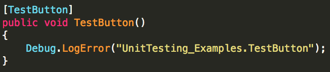
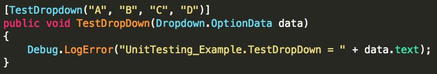
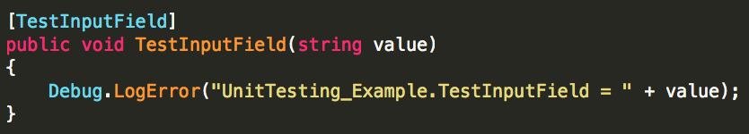
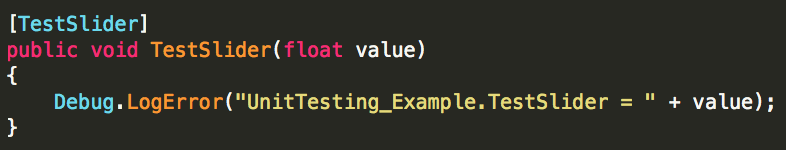
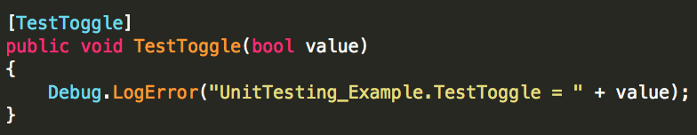
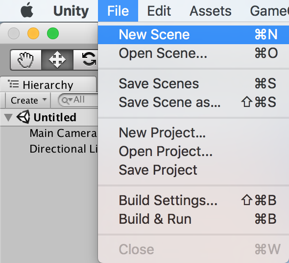
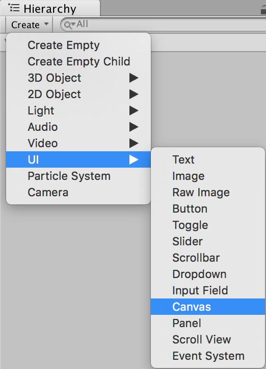
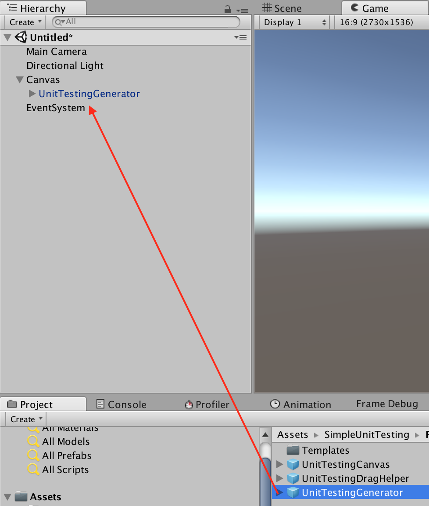
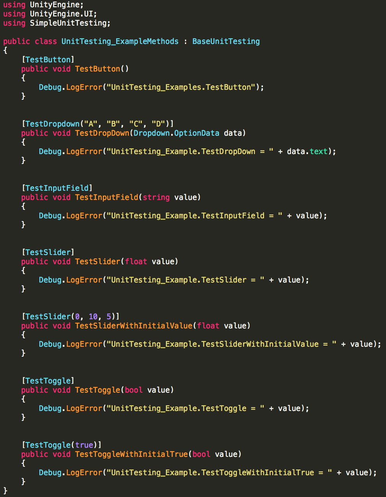
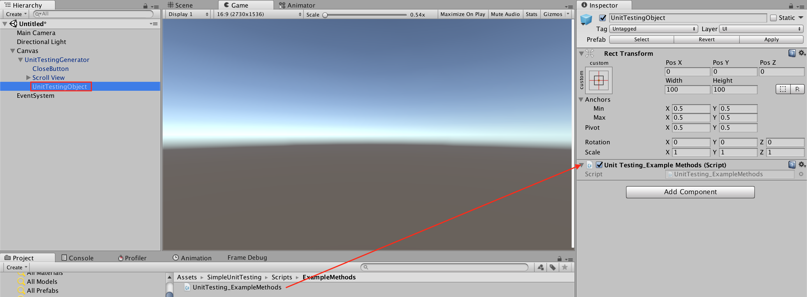

# Simple Unit Testing plugin for Unity
_Copyright (c) 2017 Ted Sie. All rights reserved._

The Simple Unit Testing plugin for Unity is an open-source project whose goal is to provide a plugin that allows Unity developer to implement unit test methods with easy steps.

## Overview
The Simple Unit Testing plugin for Unity allows you to create test methods with custom attributes. The plugin provides support for the following attributes.

Attributes:

* [TestButton]
* [TestDropdown]
* [TestInputField]
* [TestSlider]
* [TestToggle]

System requirements:

* Unity 4.6 or above.
  *Note: Unity released UGUI system with 4.6*

## Attributes Introduce
[TestButton]

[TestDropdown]

[TestInputField]

[TestSlider]

[TestToggle]

## How to setup new unit testing
1. Create a new Scene

2. Create a new Canvas

3. Drag UnitTestingGenerator in Canvas

4. Write new test method with custom attributes

5. Add component to UnitTestingObject

6. Play

## Drag Helper
The UnitTestingDragHelper is a simple switch to open/close the unit testing screen.
The idea is from iOS AssistiveTouch.

